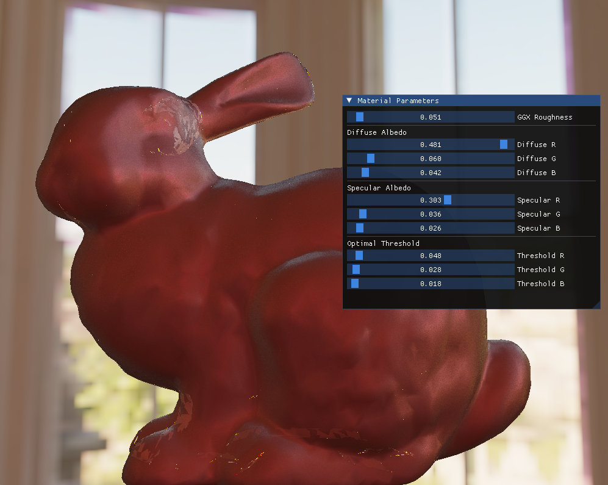

# MatSlide

Physics-Based Material Rendering & Real-Time BRDF Inference Tool

[中文](README_CN.md) | English

## Project Description

MatSlide is an interactive tool for real-time preview of neural network–generated materials, integrated with the ONNX Runtime inference engine. It allows users to adjust material parameters on the fly for neural network inference — the network receives these parameters and generates a complete measured BRDF in MERL format, with rendering results displayed in real time.




## Features

- **Environment Map Loading** : Supports high dynamic range environment maps in EXR format
- **MERL BRDF Rendering**: Accurate material rendering using the MERL Bidirectional Reflectance Distribution Function database
- **Real-Time Parameter Adjustment**: Interactively adjust GGX roughness, diffuse, and specular parameters via GUI sliders
- **Machine Learning Inference**: BRDF parameter inference powered by ONNX Runtime
- **Interactive Camera Controls**: Rotate and zoom to inspect materials from any angle
- **Multi-Pass Rendering**: Supports environment map, MERL BRDF, and IBL rendering passes

## Dependencies

- **CMake** 3.20 or higher
- **OpenGL** 3.3 or higher
- **GLFW** 3.x
- **GLAD** (OpenGL loader)
- **GLM** (OpenGL Mathematics library)
- **ImGui** (Immediate mode GUI)
- **ONNX Runtime** 1.24.4 (Windows x64)
- **TinyEXR** (EXR image loading)
- **BRDF-Loader**

## Build Instructions

1. **Clone the repository**
   ```bash
   git clone <repository-url>
   cd MatSlide
   ```

2. **Initialize submodules**
   ```bash
   git submodule update --init --recursive
   ```

3. **Download and extract ONNX Runtime**
   - Download [onnxruntime-win-x64-1.24.4.zip](https://github.com/microsoft/onnxruntime/releases/download/v1.24.4/onnxruntime-win-x64-1.24.4.zip)
   - Extract to `dependencies/onnxruntime-win-x64-1.24.4/`

4. **Configure CMake**
   ```bash
   mkdir build
   cd build
   cmake ..
   ```

5. **Build the project**
   ```bash
   cmake --build . --config Release
   ```

6. **Run the application**
   ```bash
   cd ../bin
   MatSlideApp.exe
   ```

## Usage

1. Ensure the `assets` directory contains the following:
   - `assets/onnx/decoder.onnx` — ONNX model file
   - `assets/env/envmap.exr` — Environment map file

2. After launching the application, you will see:
   - **Left panel**: Material parameter controls
   - **Right panel**: Real-time render view

3. Adjusting parameters:
   - Drag the **GGX Roughness** slider to control surface roughness
   - Adjust **Diffuse RGB** values to set the base color
   - Adjust **Specular RGB** values to control highlight color

## Project Structure

```
MatSlide/
├── src/
│   ├── core/           # Core application logic, parameter management, EXR loading
│   ├── rendering/      # Rendering passes: environment map, MERL, IBL
│   ├── inference/      # ONNX Runtime wrapper and BRDF provider
│   ├── shader/         # GLSL shader files
│   └── utils/          # Utility programs (conversion, inference)
├── dependencies/       # Third-party libraries
├── assets/             # Asset files (models, textures)
└── build_vs/           # Visual Studio build directory
```

## File Descriptions

- **main.cpp** — Application entry point; initializes rendering passes and the BRDF provider
- **Application.hpp/cpp** — Main application class; manages the window, events, and rendering passes
- **ParameterManager.hpp/cpp** — Material parameter management and GUI integration
- **BrdfProvider.hpp/cpp** — BRDF data provision and ONNX inference
- **IblMerlPass.hpp/cpp** — Rendering pass combining IBL with MERL BRDF
- **EnvMapPass.hpp/cpp** — Environment map rendering pass
- **MerlPass.hpp/cpp** — Pure MERL BRDF rendering pass
